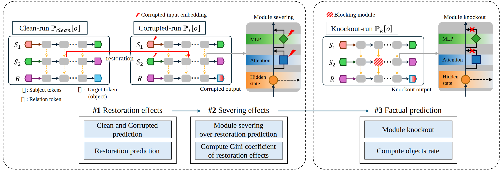

# Do All Transformers Remember Facts the Same Way?<br> A Cross-Architecture Analysis of Recall Mechanisms
---


This repository implements the method described in  
*Do All Transformers Remember Facts the Same Way? A Cross-Architecture Analysis of Recall Mechanisms*

It supports a variety of autoregressive transformer models, including:

- GPT-2 XL (1.5B)
- LLaMA-3.2-1B  
- Qwen-2.5-1.5B  
- DeepSeek-R1-Distill-Qwen-1.5B  

The framework is easily extensible to support models with different parameter scales.

To reproduce all experiments and obtain the corresponding results, simply run `easy_to_run.py`.

---
## Contents
1. [Preparation](#preparation)
2. [Restoration Effects Analysis](#restoration-effects-analysis)
3. [Severing Effects Analysis](#severing-effects-analysis)
4. [Gini Coefficient-based Concentration Analysis](#gini-coefficient-based-concentration-analysis)
5. [Factual Prediction Analysis](#factual-prediction-analysis)

---
## Preparation

All required packages for the experiment are defined in the `environment.yml`. You can set up the same Conda environment with a single command:

```bash
conda env create -f environment.yml
```
Once the installation is complete, activate the environment using:

```bash
conda activate CAARM
```

**Important**: The code has not been fully refactored yet. **Please make sure to run all examples in order**, as skipping or reordering may lead to unexpected errors.

---
## Restoration Effects Analysis
This experiment corresponds to **our first analysis (#5.1)**, which aims to quantitatively evaluate how specific modules, layers, and token-position-specific activations in autoregressive transformer models contribute to the storage and recall of factual associations.

To run the analysis, use the following command and specify the target model via the `--model_name` argument:

```bash
python experiments/restoration_effects_analysis.py --model_name "<model_name>"
```

### Examples
For **GPT-2 XL**:
```bash
python experiments/restoration_effects_analysis.py --model_name "gpt2-xl"
```

For **LLaMA-3.2-1B**:
```bash
python experiments/restoration_effects_analysis.py --model_name "meta-llama/Llama-3.2-1B"
```

For **Qwen2.5-1.5B**:
```bash
python experiments/restoration_effects_analysis.py --model_name "Qwen/Qwen2.5-1.5B"
```

For **DeepSeek-R1-Distill-Qwen-1.5B**:
```bash
python experiments/restoration_effects_analysis.py --model_name "deepseek-ai/DeepSeek-R1-Distill-Qwen-1.5B"
```

After running all examples, execute `restoration_effect_plot.py` to visualize the results. The generated figures will be saved in the `figures` directory.

---
## Severing Effects Analysis
This experiment corresponds to **our second analysis (#5.2)**, which aims to quantitatively evaluate whether the AIE-based contributions to factual recall are more concentrated in the Attention or MLP modules of autoregressive transformer models.

To run the analysis, use the following command and specify the target model via the `--model_name` argument:

```bash
python severing_effects_analysis.py --model_name "<model_name>"
```
### Examples
For **GPT-2 XL**:
```bash
python severing_effects_analysis.py --model_name "gpt2-xl"
```

For **LLaMA-3.2-1B**:
```bash
python severing_effects_analysis.py --model_name "meta-llama/Llama-3.2-1B"
```

For **Qwen2.5-1.5B**:
```bash
python severing_effects_analysis.py --model_name "Qwen/Qwen2.5-1.5B"
```

For **DeepSeek-R1-Distill-Qwen-1.5B**:
```bash
python severing_effects_analysis.py --model_name "deepseek-ai/DeepSeek-R1-Distill-Qwen-1.5B"
```

After running all examples, execute `severing_effect_plot.py` to visualize the results. The generated figures will be saved in the `figures` directory.

---
## Gini Coefficient-based Concentration Analysis
This experiment corresponds to **our second analysis (#5.2)**, which aims to quantitatively evaluate the concentration of AIE-based contributions across layers within Attention and MLP modules in autoregressive transformer models by computing the **Gini coefficient**.

To run the analysis, use the following command:
```bash
python gini_coefficient_analysis.py
```

After running the commands, execute `gini_coefficient_plot.py` to visualize the results. The generated figures will be saved in the `figures` directory.

---
## Factual Prediction Analysis
This experiment corresponds to **our third analysis (#5.3)**, which aims to more precisely evaluate the contribution of the Attention module to factual prediction by using a knockout approach that completely blocks the output of the target module.

To run the analysis, use the following command and specify the target model via the `--model_name` argument:
```bash
python factual_prediction_analysis.py --model_name "<model_name>"
```
### Examples
For **GPT-2 XL**:
```bash
python factual_prediction_analysis_gpt.py
```

For **LLaMA-3.2-1B**:
```bash
python factual_prediction_analysis.py --model_name "meta-llama/Llama-3.2-1B"
```

For **Qwen2.5-1.5B**:
```bash
python factual_prediction_analysis.py --model_name "Qwen/Qwen2.5-1.5B"
```

For **DeepSeek-R1-Distill-Qwen-1.5B**:
```bash
python factual_prediction_analysis.py --model_name "deepseek-ai/DeepSeek-R1-Distill-Qwen-1.5B"
```

After running all examples, execute `factual_prediction_plot.py` to visualize the results. The generated figures will be saved in the `figures` directory.

---
## License
<!--
This project is released under the MIT License.
-->

We build on and modify the implementations provided by  
[Meng et al., 2022](https://github.com/kmeng01/rome) and [Geva et al. (2023)](https://github.com/google-research/google-research/tree/master/dissecting_factual_predictions)
to suit our evaluation framework.

This project is **not affiliated, associated, authorized, or endorsed** by the original authors of ROME or Dissecting.  
We fully acknowledge and respect their original contributions.

---
